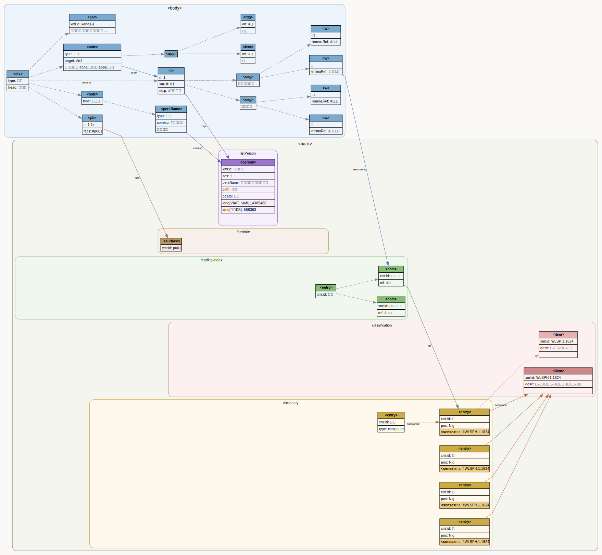

#+TITLE: 嘉禄二年本古今和歌集TEIデータへの語彙情報の統合
#+AUTHOR:
#+DATE: 2026-03-20
#+LANGUAGE: ja
#+OPTIONS: toc:t num:t

* はじめに

古今和歌集（古今集）は日本最初の勅撰和歌集である。古今集のTEI/XML によ
る電子テキスト化が文献学・書誌学・文学・言語学など各分野においてそれぞ
れの分析目的のもとで進んでいる。こうして構築されたデータセットの統合は、
多様な視点により付与された属性情報の総合利用、および、各種属性間の関連
性の分析に寄与する。そこで、2種類の古今集のTEI/XMLのオープンデータの統
合を行う。具体的には、言語学・語彙研究の志向性の強い八代集語彙データベー
スの古今集該当部分[Hodoscek] における語彙関連情報を、書誌学・文学研究
の志向性の強い嘉禄二年本『古今和歌集』の翻刻データ[ikuura]の該当文字列
へマッピングする。本稿では、その作業プロセスについて説明する。
* データソース

** 嘉禄二年本古今和歌集（文学・書誌データ）
嘉禄二年本古今和歌集TEIデータ [ikuura] をベースにする。[ikuura] で作成されているデータでは、和歌研究の基盤である『新編国歌大観』などのデジタルテキストでは省略されてしまっていた「写本の書式」「各種注記（勘物など）」「他本の異文」「作者属性を付与した人物一覧」とそれらの紐づけなどが詳細に記述している。それにより、定本テキストの相対化と、多様な写本のデジタル上の共存が実現されているのみならず、定家本以外の「異文」、性別に応じた語彙（男性特有表現など）が検索できるようになる。これからの諸分野からアプローチされる和歌研究の基礎データとなると期待される。
** 八代集語彙データセット（語彙データ）
八代集データセットは、和歌を対象とした語彙研究の基礎資料として利用されている。同データセットでは古今集を含めた8つの勅撰集が格納され、和歌の用語の語彙論的情報、たとえば、複数基準の品詞タグ、意味分類概念タグ、各語のレンマが付与されている。文字列検索のみならず、歌語のレンマや概念カテゴリで言語学的情報を利用したより自由な検索が可能である。この語彙データの中の古今集相当の部分を前掲文学・書誌データの補強として、組み込み配布する。

* 作成データの構造の現状
** 底本TEIのタグの保持
[ikuura] のデータは、写本の書誌的・物理的記述（ =<msDesc>=、
=<physDesc>=、=<handDesc>= 等）、図版との対応（ =<facsimile>= ）、人物
情報（ =<listPerson>= ：複数の名前形・生没年・VIAFリンク等を含む）、伝
本情報（ =<listWit>= ）、本文異同（ =<app>= ・ =<lem>= ・ =<rdg>= ）、
ルビ（ =<ruby>= ）、損傷・書き入れ（ =<damage>= ・ =<additions>= ）な
ど、書誌学的観点から多層的な注釈を施したデータである。本稿における統合
作業はこれらの既存要素を改変せず、新たな要素の追加のみによって行われた。
詳細な構造については [ikuura] を参照されたい。

** 追加要素1：=<w>= による語彙注釈
統合の中核は、嘉禄二年本の本文テキストへの =<w>= 要素による語彙注釈である。既存の =<seg>= 内のテキストを語単位に分割し、各 =<w>= 要素の =lemmaRef= 属性により、=<back>= に収録した語彙辞書の該当エントリへの参照を付与した[fig]。

#+BEGIN_SRC xml
<seg>
  <w lemmaRef="#とし.年">年</w>
  <w lemmaRef="#の.の">の</w>
  <w lemmaRef="#うち.内">内</w>
  <w lemmaRef="#に.に">に</w>
  <w lemmaRef="#はる.春">春</w>
  <w lemmaRef="#は.は">は</w>
  <w lemmaRef="#き.来">き</w>
  <w lemmaRef="#に.ぬ">に</w>
  <w lemmaRef="#けり.けり">けり</w>
</seg>
#+END_SRC

=lemmaRef= の値は二層構造の語彙IDであり、 =#読み.見出し語= の形式をとる。「読み」は八代集データにおける当該トークンの活用形の仮名表記、「見出し語」は辞書見出し語形（漢字形またはかな形）である。例えば =#き.来= は動詞「来」の活用形「き」を、 =#に.ぬ= は助動詞「ぬ」の活用形「に」を指す。

底本TEIに既存の =<app>= 構造（=<lem>=・=<rdg>=）を持つ箇所では、各枝のテキストに対してそれぞれ独立した =<w>= 注釈を付与した。

#+BEGIN_SRC xml
<app>
  <lem wit="#国">
    <w lemmaRef="#みら.見">見らむ</w>
  </lem>
  <rdg wit="#前">
    <w lemmaRef="#みえ.見ゆ">みえ</w>
    <w lemmaRef="#む.む">ん</w>
  </rdg>
</app>
#+END_SRC

** 追加要素2：=<back>= 語彙辞書の統合

八代集語彙データベース [Hodoscek] から抽出した語彙情報を、底本 TEI の
=<back>= 要素内に reading-index・dictionary・classification の 3 つの
=
= として統合した。

*** =
= ：読み索引

reading-index は =<w lemmaRef>= の直接の参照先となる索引であり、
活用形の仮名表記をキーとする =<entry>= を収録している。
各エントリには同音異義語ごとに =<hom>= を列挙し、その =xml:id= は
=読み.見出し語= の形式（例：=あき.秋=、=あき.飽く=）をとる。
この =xml:id= は本文中の =<w lemmaRef>= の値と1対1で対応しており、
各 =<hom>= は =<ref>= により辞書本体の対応 =<entry>= へリンクする。

#+BEGIN_SRC xml
<entry xml:id="あき">
  <hom n="1" xml:id="あき.秋">
    <ref target="#秋" />
  </hom>
  <hom n="2" xml:id="あき.飽く">
    <ref target="#飽く" />
  </hom>
</entry>
#+END_SRC

*** =
= ：語彙辞書本体

辞書本体は各見出し語を =<entry xml:id="見出し語">= として収録している。
各エントリは、見出し語形と読みを記述する =<form type="lemma">=、
品詞情報を収録する =<gramGrp>= （=<pos>= に UniDic/IPA の品詞値を格納）、
および語義を記述する =<sense>= から構成される。
=<sense>= は =ana= 属性により WLSPH および WLSP の分類コードを参照し、
必要に応じて =<def>= 要素に意味記述を付与する。
同字異義語は =<hom xml:id="見出し語.hN">= により区別され、各 =<hom>= が
独立した品詞情報を持つ（reading-index の =<hom>= が同音異義の解消に
用いられるのに対し、dictionary の =<hom>= は同字異義の区別に用いられる）。
複合語エントリは =<form type="compound">= 内に構成要素への =<ref>= を列挙する [fig]。

#+BEGIN_SRC xml
<!-- 単純語・同字異義語あり -->
<entry xml:id="か" type="simplex">
  <form type="lemma">
    <orth xml:lang="ja">か</orth>
    <pron notation="kana">か</pron>
  </form>
  <hom n="1" xml:id="か.h1">
    <gramGrp><pos value="P.bind">P.bind</pos></gramGrp>
  </hom>
  <hom n="2" xml:id="か.h2">
    <gramGrp><pos value="P.fin">P.fin</pos></gramGrp>
  </hom>
  <sense xml:id="か.s1" ana="#WLSPH.8.0065" />
</entry>

<!-- 複合語 -->
<entry xml:id="うたた寝" type="compound">
  <form type="lemma">
    <orth xml:lang="ja">うたた寝</orth>
    <pron notation="kana">うたたね</pron>
  </form>
  <form type="compound">
    <ref target="#転た">転た</ref>
    <ref target="#寝ぬ">寝ぬ</ref>
  </form>
  <gramGrp><pos value="N.g">N.g</pos></gramGrp>
  <sense ana="#WLSPH.1.3002 #WLSP.1.3002">
    <def xml:lang="ja">体-活動-心-感動・興奮</def>
  </sense>
</entry>
#+END_SRC

*** =
= ：分類語彙表索引

classification は分類語彙表のカテゴリを =<item xml:id="…">= として収録する
索引であり、dictionary の =<sense ana="#">= からの参照先として機能する。
各 =<item>= は =<label>= （分類番号）と =<desc>= （階層的カテゴリ名）を持つ。

本データセットでは二種の分類体系を収録している。
=classWLSPH=（1000 項目）は中野 [nakano] による旧分類語彙表番号に基づく
八代集版であり、=<sense ana="#WLSPH.N.NNNN">= による主参照先となる。
=classWLSP=（343 項目）は現行の分類語彙表番号に基づく体系であり、
=<sense ana="#WLSP.N.NNNN">= による補助参照として収録する。

#+BEGIN_SRC xml

  <head>分類語彙表 (WLSPH — 八代集版)</head>
  <list>
    <item xml:id="WLSPH.1.1624">
      <label>1.1624</label>
      <desc>体-抽象的関係-位置・地点・場合-季節</desc>
    </item>
    …
  </list>

#+END_SRC

*** 参照関係のまとめ
=<w lemmaRef="#あき.秋">= → reading-index の =<hom xml:id="あき.秋">= →
=<ref target="#秋">= → dictionary の =<entry xml:id="秋">= という
二段階の間接参照により、読みによる多義語の解消と辞書本体の簡潔な構造を両立する。

#+caption: 統合 TEI データにおける参照関係の概要
#+name: fig:data-structure
#+attr_html: :width 100%
#+attr_latex: :width \textwidth

* 作業プロセス
** 自動照合

第一段階として、自作したツールよる一括自動照合を実施する。処理の流れは以下の通りである。

1. 嘉禄二年本の =<body>= 内の全 =<l n="N">= を走査する。
2. =<seg>= のテキストを抽出する。
3. トークンの表層形（Surface）を先頭から順に各 =<seg>= テキストに対して完全一致の前置接頭照合で突き合わせる。全トークンの表層形が各セグメントのテキストに過不足なく消費された場合に照合成功とする。
4. 照合成功の歌には =<w lemmaRef="…">= を書き込む。

実行後に得られる照合結果をエディタにポップアップし、次段階の手作業修正へ引き継ぐ。

** インタラクティブ修正
自動照合した歌に対し修正を行った。このツールは Claude Code のスラッシュコマンド
=/align-poem N= ・ =/apply-poem N= として実装されており、LLM との対話セッション内で
呼び出している。

=/align-poem N= は対象歌の八代集トークン列と嘉禄二年本テキストを照合し、
表層形と =lemmaRef= の対応表をドラフトファイルとして生成したうえで
テキストエディタを起動する。ドラフトは一行一トークンの形式で、
左列（表層形）のみ編集可能とし、右列（=lemmaRef=）は参照用として固定する。
各グループ（=<seg>= 対応）の左列を連結した文字列が嘉禄二年本テキストに
完全一致することが照合条件となる。

編集者はエディタ上で表層形列のみを修正し、必要に応じてトークンを分割・
結合することで嘉禄二年本の字体・仮名遣いに合わせる。

=/apply-poem N= はドラフトを読み込み、各グループの表層形連結を嘉禄二年本テキストと
照合したうえで =<w lemmaRef="…">= 要素を =kokin-annotated.xml= に書き込む。
検証失敗時はエラーメッセージをドラフトに注入してエディタを再度起動し、
修正ループに戻る。

以上の自動提案→レビュー→修正→書き込みのサイクルを歌単位で繰り返し実行した。

* 応用の展望
本統合データセットは、語彙・書誌の二層を単一の TEI XML に収めることで、
従来の文字列検索あるいは語彙検索を統合し、さらに多様な検索方式を可能にする。
辞書の =<back>= 構造は有向グラフとして捉えられ、「検索」とは
(1) 入口ノードの選択（=<back>= のどのインデックスを入口とするかの選択）、
(2) 辺の通過範囲（どの関係まで展開するか）、
(3) 本文への投影（=<w lemmaRef>= を逆引きして =<body>= に戻る）
という三段階の操作である。以下では代表的な検索例を示す。

** COMMENT 検索の分類

**** クエリの種類
クエリの種類は、=<back>= のどのインデックスを入口とするかの選択である。
=<back>= には以下の四種類の構造が収められており、それぞれ異なる軸での
検索を可能にする。

*表層文字列*: インデックスを経由せず、=<body>= の =<w>= テキストを直接照合する。
最も単純だが、字体の揺れ（漢字・仮名・歴史的仮名遣い）には対応しない。

*reading-index*: 仮名読みをキーとするインデックス（=
=）。
各 =<entry>= は読み文字列を =xml:id= に持ち、その下に同音異語
（=<hom xml:id="reading.lemma">=）を列挙する。読みで検索し、
対応する =<w lemmaRef>= を逆引きして本文トークンを得る。

*dictionary*: 見出し語（レンマ）をキーとする語彙辞典（=
=）。
品詞・語形・意味カテゴリ（=<sense @ana>= の WLSP コード）を保持する。
語キーまたは概念キーによる検索の起点となる。

*classification*: WLSP（分類語彙表）のカテゴリ階層（=
=）。
意味カテゴリコード（例：=WLSP.1.1624= 体-関係-時間-季節）を入口に、
=dictionary= の =<sense @ana>= を介して関連語を一括取得できる。

*listPerson*: 人物情報（=<listPerson>=）。歌人・書写者の =xml:id= をキーに、
=<body>= 内の人物参照（=<author>=、=<persName>= 等）を検索できる。

**** 検索アプローチ
クエリの種類で決まった入口ノードを起点として、そのノードが持つ辺を
辿ることで隣接するノードを次の検索キーとして利用できる。

入口が *=<hom>=*（reading-index 経由）の場合：
- =ref= 辺を辿り =<entry>=（見出し語）へ → 同じレンマを持つ別の読みを取得
- reading 部分が共通する別 =<hom>= へ → 同音異語の取得

入口が *=<entry>=*（dictionary 経由）の場合：
- =<hom>= を介して reading-index へ → その語のすべての読みを取得
- =<sense @ana>= の WLSP コードを辿り classification へ → 同概念語の =<entry>= を取得

入口が *classification*（WLSP コード）の場合：
- 同コードを持つ =<entry>= を横断 → 意味カテゴリ内の全見出し語を取得
- さらに各 =<entry>= から =<hom>= を経由して本文トークンへ展開

いずれの経路でも、最終ステップは =<hom xml:id>= と =<w @lemmaRef>= の
照合による =<body>= への投影である。

** COMMENT グラフとしての参照構造

辞書の =<back>= 構造は次の有向グラフとして捉えられる。

「検索」とは、(1) 入口ノードの選択（どの軸でグラフに入るか）、
(2) 辺の通過範囲（どの関係まで展開するか）、
(3) 本文への投影（=<w lemmaRef>= を逆引きして =<body>= に戻る）
という三段階の操作である。以下では代表的な三種類の具体例を示す。

** COMMENT 表層文字列による検索

最も単純な検索として、=<w>= 要素のテキスト内容（表層形）による照合を行う。

#+begin_src xpath
//w[text()='春']
#+end_src

これは表層形が「春」と完全一致するすべてのトークンを返す。例えば第一首では
次のような要素がヒットする。

#+begin_src xml
<w lemmaRef="#はる.春">春</w>
#+end_src

当該トークンを含む歌の番号を列挙するには、述語を祖先の =<l>= に移せばよい。

#+begin_src xpath
//l[descendant::w[text()='春']]/@n
#+end_src

** COMMENT 語（レンマ・読み）による検索

表層形が漢字・仮名・歴史的仮名遣いで揺れる場合でも、=lemmaRef= 属性を介
することで同一語のすべての出現を横断的に検索できる。

=lemmaRef= の形式は =#reading.lemma= であるため、レンマ「春」の全用例は
次のクエリで得られる。

#+begin_src xpath
//w[contains(@lemmaRef, '.春')]
#+end_src

これにより、漢字表記「春」と仮名表記「はる」の両方が捕捉される。

#+begin_src xml
<w lemmaRef="#はる.春">春</w>   <!-- 漢字表記 -->
<w lemmaRef="#はる.春">はる</w>  <!-- 仮名表記 -->
#+end_src

** COMMENT 意味カテゴリによる検索

WLSP（分類語彙表）のカテゴリを手がかりにした検索は二段階で行う。

*第一段階*: =<back>= の辞書から対象カテゴリを持つ見出し語エントリを特定する。
カテゴリ 1.1624「体－関係－時間－季節」を例に取る。

#+begin_src xpath
//entry[sense[contains(@ana, 'WLSP.1.1624')]]
#+end_src

*第二段階*: 得られた =xml:id=（例：=春=）を =lemmaRef= サフィックスとして
=<body>= を検索する。

#+begin_src xpath
//w[contains(@lemmaRef, '.春')]
#+end_src

この二段階の流れは、=<sense ana>= に付与した意味カテゴリ →
=<def>= の解説 → =<w lemmaRef>= による本文中の用例、という
参照構造全体を活用するものである。

** 意味カテゴリによる関連語横断検索：うぐひすから鳥類の歌へ

reading-index を入口に、意味カテゴリを経由して関連語を横断する検索の例を示す。
「うぐひす」で reading-index を引くと、=<hom xml:id="うぐひす.鴬">= が得られ、
その =<ref>= から dictionary の =<entry xml:id="鴬">= に到達する。
この =<entry>= の =<sense ana="#WLSPH.1.5620">= が示すカテゴリは
「体-自然・物体・物質-動物-鳥」であり、同カテゴリを持つ全エントリを取得することで、
「ほととぎす」「雁」などを含む鳥類語を一括して抽出できる。

#+begin_src xpath
(: Step 1: 鳥カテゴリの全エントリを取得 :)
//entry[sense[contains(@ana, 'WLSPH.1.5620')]]/@xml:id

(: Step 2: 本文中の対応トークンを含む歌番号を返す :)
//l[descendant::w[contains(@lemmaRef, '.鴬')
               or contains(@lemmaRef, '.鶯')
               or contains(@lemmaRef, '.ほととぎす')]]/@n
#+end_src

** 同音語検索：「あき」から秋・飽くを含む歌へ

reading-index では同一読みの異なる見出し語が同一 =<entry>= 下に列挙されるため、
読みを入口に同音語すべての用例を横断検索できる。=<entry xml:id="あき">= の下には
=<hom xml:id="あき.秋">= と =<hom xml:id="あき.飽く">= の二つが収録されており、
両者を含む歌をまとめて取得できる。

#+begin_src xpath
(: あき の全同音語 hom を取得 :)
//div[@type='reading-index']//entry[@xml:id='あき']/hom/@xml:id

(: 秋・飽く いずれかを含む歌番号を返す :)
//l[descendant::w[contains(@lemmaRef, 'あき.')]]/@n
#+end_src

これにより、掛詞として「秋」と「飽き」を重ねる和歌表現の用例を、
表層形にとらわれず読みの軸で網羅的に抽出できる。

** 物名歌における文字列検索との両立

物名歌（物の名を詩句中に隠した歌）では、隠された語が複数の語に分割される位置を
またいで現れることがある。=<w>= による分かち書きはその位置に語境界を置くが、
=<seg>= の文字列は =<w>= の内容を連結した原文そのままであるため、隠し語による
文字列検索には影響しない。たとえば「うぐひす」が =<w>うぐ</w><w>ひす</w>= と
分割されていても、次のクエリは物名としての「うぐひす」を正しく検索する。

#+begin_src xpath
//seg[contains(string(.), 'うぐひす')]
#+end_src

このように、語レベルの注釈（=<w lemmaRef>=）と表層文字列検索は同一データ上で
独立して共存しており、それぞれが干渉することなく利用できる。

** 歴史的仮名遣いを越えた検索

嘉禄二年本は歴史的仮名遣いで表記されているため、現代仮名遣いによる表層検索は
正しく機能しない。たとえば「こえ」（声）を =text()= で検索しても、本文中の
表記は「こゑ」であるためヒットしない。同様に「いる」（居る）を検索しても
「ゐる」と書かれた用例は捕捉できない。

#+begin_src xpath
(: 表層検索は仮名遣いの差で失敗する :)
//w[text()='こえ']   (: → 0件 :)
//w[text()='いる']   (: → 0件 :)
#+end_src

一方、=lemmaRef= のレンマ部分（=.見出し語= サフィックス）は辞書の見出し語形で
あるため、仮名遣いによらず全用例を捕捉できる。

#+begin_src xpath
(: lemmaRef のレンマ部分で検索すれば仮名遣いに依存しない :)
//w[contains(@lemmaRef, '.声')]   (: こゑ・こえ いずれの表記も捕捉 :)
//w[contains(@lemmaRef, '.居る')] (: ゐる・いる いずれも捕捉 :)
#+end_src

この性質により、現代仮名遣いで入力したクエリを辞書の見出し語形に変換するだけで、
歴史的仮名遣いで書かれた本文全体を透過的に検索できる。

* おわりに
本稿では、書誌情報と語彙情報という異なる研究志向を持つ二つの古今和歌集 TEI
データソースを単一のファイルに統合する試みを報告した。嘉禄二年本の文書構造を
底本として保持しつつ、八代集語彙データセットの =<back>= 辞書・読み索引・
分類語彙表を埋め込み、本文中の各語を =<w lemmaRef>= で辞書エントリに紐付ける
ことで、字体・読み・意味カテゴリの複数軸による検索を可能にするデータ構造を
構築した。

注釈付与の作業プロセスにおいては、完全自動化ではなく LLM エージェントとの
協同編集という形態を採用した。ルールベースの自動照合で大半の語を処理しつつ、
字体の揺れや異体字を含む箇所については =/align-poem= ・ =/apply-poem=
コマンドを通じた対話的なレビュー・修正サイクルで補完した。このアプローチは、
作品固有の表記規則への対応や編集判断の記録において、純粋な自動化よりも
柔軟性と透明性を両立できる点で有効であった。

データ自体には、複合可能な語の判断や、ルビ要素におけるタグづけ、和歌以
外のテキストの語彙層の追加など、さまざまな修正が求められる。データの構
造に関しても今後引き続き見直したい。
