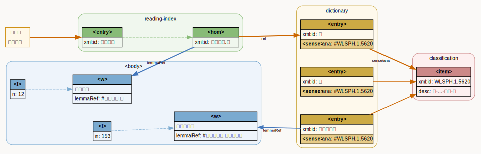
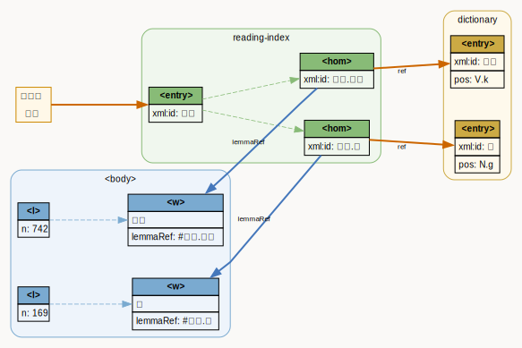
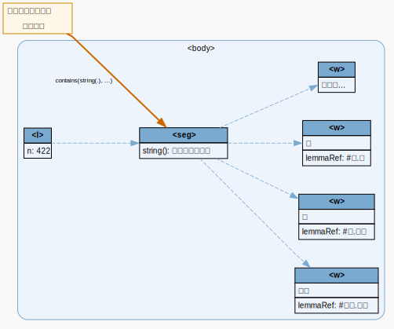
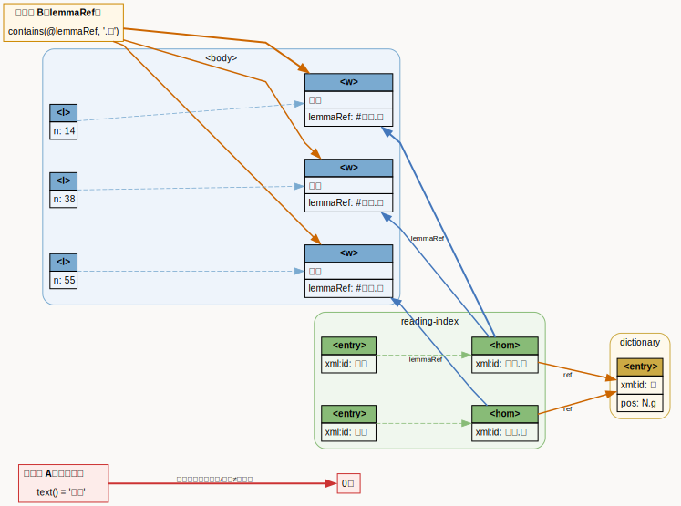

#+TITLE: 古今和歌集語彙TEI準拠データの翻刻TEI準拠データへのマッピング
#+AUTHOR:
#+DATE: 2026-03-20
#+LANGUAGE: ja
#+OPTIONS: toc:t num:t

* はじめに
古今和歌集（古今集）は日本最初の勅撰和歌集である。近年、古今集の
TEI/XMLによる電子テキスト化が文献学・書誌学・文学・言語学などの各分野
でそれぞれの研究目的のもとに進んでいる。こうして構築された複数のデータ
セットを統合することで、多様な視点の属性情報を横断的に利用し、属性間の
関係を分析できるようになる。

本稿では、研究志向の異なる2つの古今集 TEI/XML オープンデータを統合する。
具体的には、言語学・語彙研究志向の八代集データセット [hodoscek] の語彙
情報を、書誌学・文学研究志向の嘉禄二年本『古今和歌集』翻刻データ
[ikuura] の各文字列にマッピングする。本稿では、作成データの構造、作業
プロセスを報告し、応用可能の例として和歌検索の事例を議論する。

* データソース
本稿で用いるデータソースは、嘉禄二年本古今和歌集 TEI データ [ikuura]
と八代集データセット [hodoscek] の2つであり、いずれもオープンデータと
して配布されている。

** 嘉禄二年本古今和歌集（底本データ）
嘉禄二年本古今和歌集 TEI データ [ikuura] をベースとする。[ikuura] では、
和歌研究の基盤である『新編国歌大観』などのデジタルテキストで省略されて
いた「写本の書式」「各種注記（勘物など）」「他本の異文」「作者属性を付
与した人物一覧」とそれらの紐づけを詳細に記述する。これにより、定本テキ
ストの相対化と多様な写本のデジタル上の共存が実現されるのみならず、定家
本以外の異文や性別に応じた語彙（男性特有表現など）の検索も可能となる
[ikuura]。各分野における和歌研究の基礎データとなることが期待される。

** 八代集語彙データセット（語彙データ）
八代集データセット [hodoscek] は、和歌を対象とした語彙研究の基礎資料で
ある。同データセットには古今集を含む8つの勅撰集が格納され、各語に品詞・
意味分類・レンマなどの語彙論的情報が付与されている。これにより、文字列
検索のみならず、レンマや概念カテゴリを軸とした検索が可能となる。本稿で
は、このデータセットの古今集該当部分を前掲の底本データに組み込んで配布
する。

* 作成データの構造の現状
本節では以上のデータソースから作成したデータの構造を説明する。作成手順
については第4節（作業プロセス）を参照されたい。

** 底本データのタグの保持
底本データ [ikuura] は、写本の書誌的・物理的記述 (=<msDesc>=,
=<physDesc>=, =<handDesc>=)、図版との対応 (=<facsimile>=)、人物情報
（名前・名前の読み・生没年・VIAFリンク等）、伝本情報 (=<listWit>=)、本
文異同 (=<app>=, =<lem>=, =<rdg>=)、損傷・書き入れ (=<damage>=,
=<additions>=) など、書誌学・文献学・文学的観点から多層的な注釈を施し
たデータである。本稿の統合作業ではこれらの既存要素を改変せず、新要素の
追加のみで統合を行った。詳細な構造については [ikuura] を参照されたい。

** 追加要素1：=<w>= による語彙タグの追加
追加レイヤの中核は、底本データのテキストへの =<w>= 要素による語彙タグ
である。既存の =<seg>= 内のテキストを語単位に分割し、各 =<w>= の
=lemmaRef= 属性で =<back>= の辞書エントリにリンクした [[fig:w-annotation]]。

#+name: fig:w-annotation
#+caption: =<seg>= を =<w lemmaRef>= で語単位に分割した例（第1首冒頭）
#+BEGIN_SRC xml
<seg>
  <w lemmaRef="#とし.年">年</w>
  <w lemmaRef="#の.の">の</w>
  <w lemmaRef="#うち.内">内</w>
  <w lemmaRef="#に.に">に</w>
  <w lemmaRef="#はる.春">春</w>
  <w lemmaRef="#は.は">は</w>
  <w lemmaRef="#き.来">き</w>
  <w lemmaRef="#に.ぬ">に</w>
  <w lemmaRef="#けり.けり">けり</w>
</seg>
#+END_SRC

=lemmaRef= の値は2層構造の語彙IDで、 =#読み.見出し語= の形式をとる。
「読み」は語彙データ [hodoscek] における当該トークンの活用形の仮名表記、
「見出し語」は辞書見出し語形（漢字形またはかな形）である。例えば =#き.
来= は動詞「来」の活用形「き」を、 =#に.ぬ= は助動詞「ぬ」の活用形「に」
を指す。底本データに既存の =<app>= 構造 (=<lem>=・=<rdg>=) を持つ箇所
では、各枝のテキストに対してそれぞれ独立した =<w>= 注釈を付与した
[[fig:app-annotation]]。

#+name: fig:app-annotation
#+caption: =<app>= の各枝（=<lem>=・=<rdg>=）にそれぞれ =<w>= を付与した例
#+BEGIN_SRC xml
<app>
  <lem wit="#国">
    <w lemmaRef="#みら.見">見らむ</w>
  </lem>
  <rdg wit="#前">
    <w lemmaRef="#みえ.見ゆ">みえ</w>
    <w lemmaRef="#む.む">ん</w>
  </rdg>
</app>
#+END_SRC

** 追加要素2：=<back>= 語彙辞書の追加
第2の追加要素は、語彙タグが参照する辞書項目の追加である。語彙データ
[hodoscek] から抽出した語彙情報を、底本データ [ikuura] の =<back>= 要
素内に reading-index、dictionary、classification の3つの =
= とし
て統合した。

*** =
= ：読み索引
reading-index は =<w lemmaRef>= の参照先となる索引で、活用形の仮名表記
をキーとする =<entry>= を格納する。各エントリには同音異義語ごとに
=<hom>= を列挙し、その =xml:id= は =読み.見出し語= の形式(=あき.秋=,
=あき.飽く=) をとる。 =xml:id= の値は本文中の =<w lemmaRef>= と1対1で対応
する。各 =<hom>= は =<ref>= により辞書本体の =<entry>= へリンクする
[[fig:reading-index-ex]]。

#+name: fig:reading-index-ex
#+caption: reading-index の =<entry>= ・=<hom>= 構造の例（「あき」）
#+BEGIN_SRC xml
<entry xml:id="あき">
  <hom n="1" xml:id="あき.秋">
    <ref target="#秋" />
  </hom>
  <hom n="2" xml:id="あき.飽く">
    <ref target="#飽く" />
  </hom>
</entry>
#+END_SRC

*** =
= ：語彙辞書本体
辞書本体は各見出し語を =<entry xml:id="見出し語">= として格納する。各
エントリは =<form type="lemma">= （見出し語形・読み）、=<gramGrp>=
(=<pos>= に UniDic/IPA 品詞値)、 =<sense>= （語義）で構成される。
=<sense>= の =ana= 属性は語彙データの分類語彙表番号 (WLSPH) および現行
分類語彙表番号 (WLSP) を参照し [fn::次節で説明する。]、=<def>= 要素で
意味記述を付与できる。同字異義語は =<hom xml:id="見出し語.hN">= で区別
され、各 =<hom>= が独立した品詞情報を持つ [fn::reading-index の
=<hom>= が同音異義の解消に用いられるのに対し、dictionary の =<hom>= は
同字異義の区別に用いられる]。複合語エントリは =<form type="compound">=
内に構成要素への =<ref>= を列挙する [[fig:dictionary-ex]]。

#+name: fig:dictionary-ex
#+caption: dictionary の =<entry>= 構造の例（単純語・同字異義語と複合語）
#+BEGIN_SRC xml
<!-- 単純語・同字異義語あり -->
<entry xml:id="か" type="simplex">
  <form type="lemma">
    <orth xml:lang="ja">か</orth>
    <pron notation="kana">か</pron>
  </form>
  <hom n="1" xml:id="か.h1">
    <gramGrp><pos value="P.bind">P.bind</pos></gramGrp>
  </hom>
  <hom n="2" xml:id="か.h2">
    <gramGrp><pos value="P.fin">P.fin</pos></gramGrp>
  </hom>
  <sense xml:id="か.s1" ana="#WLSPH.8.0065" />
</entry>

<!-- 複合語 -->
<entry xml:id="うたた寝" type="compound">
  <form type="lemma">
    <orth xml:lang="ja">うたた寝</orth>
    <pron notation="kana">うたたね</pron>
  </form>
  <form type="compound">
    <ref target="#転た">転た</ref>
    <ref target="#寝ぬ">寝ぬ</ref>
  </form>
  <gramGrp><pos value="N.g">N.g</pos></gramGrp>
  <sense ana="#WLSPH.1.3002 #WLSP.1.3002">
    <def xml:lang="ja">体-活動-心-感動・興奮</def>
  </sense>
</entry>
#+END_SRC

*** =
= ：分類語彙表番号索引
classification は分類語彙表のカテゴリを =<item xml:id="…">= として格納
する索引で、dictionary の =<sense ana="#">= の参照先となる。各
=<item>=は =<label>= （分類番号）と =<desc>= （階層的カテゴリの説明）
を持つ。

データセットでは2種の分類体系を格納している。 =classWLSPH= は [nakano]
による旧分類語彙表番号に基づく八代集版で、 =<sense
ana="#WLSPH.N.NNNN">= の主参照先となる。 =classWLSP= は現行分類語彙表
番号に基づく体系で、 =<sense ana="#WLSP.N.NNNN">= の補助参照として格納
する。

#+BEGIN_SRC xml

  <head>分類語彙表 (WLSPH — 八代集版)</head>
  <list>
    <item xml:id="WLSPH.1.1624">
      <label>1.1624</label>
      <desc>体-抽象的関係-位置・地点・場合-季節</desc>
    </item>
    …
  </list>

#+END_SRC

** データにおける参照関係のまとめ
作成データセットにおける参照関係の全体像を図 [[fig:data-structure]] に示す。
=<body>= 側では、 =<l>= （歌）が =<seg>= を介して複数の =<w>= に分割さ
れ、各 =<w>= の =lemmaRef= 属性が reading-index の =<hom>= を指す。図
の例では =<w lemmaRef="#はる.春">= → reading-index の =<hom xml:id="は
る.春">= → =<ref target="#春">= → dictionary の =<entry xml:id="春">=
という2段階の間接参照をたどる。reading-index の =<entry xml:id="はる
">= には =はる.春= と =はる.張る= の2つの =<hom>= が列挙されており、こ
の層で同音異義を解消する。

=<back>= の dictionary には春・秋・夏・冬の各エントリが格納され、いず
れも =<sense ana="#WLSPH.1.1624">= により同一の季節カテゴリに紐付く。
複合語 =春霞= は =type="compound"= のエントリとして独立し、=component=
辺で構成要素の =春= エントリへリンクする。classification には八代集版
(WLSPH) と現行分類語彙表番号 (WLSP) の2体系が格納されており、
dictionary の =<sense>= から両体系への参照が可能である。

=<persName corresp="#在原元方">= および =<l resp="#在原元方">= の双方
が listPerson の =<person xml:id="在原元方">= へリンクし、VIAF・国書デー
タベースの外部識別子と接続される。=<pb facs="#p001">= は facsimile の
=<surface xml:id="p001">= を参照し、本文と画像の対応を記録する。

#+caption: 統合 TEI データにおける参照関係の概要
#+name: fig:data-structure
#+attr_html: :width 100%
#+attr_latex: :width \textwidth
[[file:data-structure.svg]]

* 作業プロセス
上記データの作成は次の3段階で行う。

1. 辞書類項目の生成
2. 語彙タグの自動照合
3. インタラクティブ修正

段階2および3では LLM エージェント (Claude Code) を活用し、照合の自動化
と人間による編集判断を組み合わせた協同編集の形態をとった。

** 辞書類項目の生成
辞書類項目の生成は2段階で行う。第1段階では、語彙データ [hodoscek] のイ
ンライン =<w>= タグを走査し、トークンの表層形・読み・品詞・分類コード
を収集する。収集した情報から reading-index の =<entry>/<hom>= と
dictionary の =<entry>= を構築し、分類語彙表データと突き合わせて
classification の =<item>= 一覧を生成する。第2段階では、生成した
reading-index、dictionary、classification の各 =
= を底本データ
[ikuura] の既存の =<back>= （listPerson・facsimile 等を含む）の先頭に
挿入して統合ファイルのベースとする。

** 語彙タグのマッピング
自作ツールで語彙データ [hodoscek] のトークンと底本データ [ikuura] の文
字列を自動照合した。処理の流れは以下の通りである。

1. 底本データの =<body>= 内の全 =<l n="N">= を走査する。
2. =<seg>= のテキストを抽出する。
3. トークンの表層形 (Surface) を先頭から順に各 =<seg>= テキストと前置
   接頭照合する。全トークンが過不足なく消費された場合に照合成功とする。
4. 照合成功の歌に =<w lemmaRef="…">= を書き込む。

照合結果をエディタに表示し、次段階のインタラクティブ修正に引き継ぐ。

** インタラクティブ修正
未照合・要修正の歌に対しては、自作ツールを Claude Code のスラッシュコ
マンド =/align-poem N= と =/apply-poem N= として実装し、LLM との対話セッ
ション内で呼び出す。

=/align-poem N= は対象歌の語彙データのトークン列と底本データのテキスト
を照合し、表層形と =lemmaRef= の対応表をドラフトファイルとして生成した
うえでテキストエディタを起動する。ドラフトは一行一トークンの形式で、左
列（表層形）のみ編集可能とし、右列 (=lemmaRef=) は参照用として固定する。
各グループ（ =<seg>= 対応）の左列連結が底本データのテキストと完全一致
することを照合条件とする。筆者らはエディタ上で表層形列のみを修正し、必
要に応じてトークンを分割・結合することで嘉禄二年本の字体・仮名遣いに合
わせた。

=/apply-poem N= はドラフトを読み込み、各グループの表層形連結を嘉禄二年
本テキストと照合したうえで =<w lemmaRef="…">= 要素を
=kokin-annotated.xml= に書き込む。検証失敗時はエラーメッセージをドラフ
トに注入してエディタを再度起動し、修正ループに戻る。

以上の「自動提案→レビュー→修正→書き込み」のサイクルを歌単位で繰り返し
実行した。

* 応用の展望
本統合データセットは、語彙・書誌の2層を単一の TEI XML に収めることで、
文字列検索と語彙検索を統合し、多様な検索方式を可能にする。辞書の
=<back>= 構造は有向グラフとして捉えられ、「検索」とは次の3段階の操作で
ある。

1. 入口ノードの選択（どのインデックスを起点とするか）
2. 辺の通過範囲（どの関係まで展開するか）
3. 本文への投影（ =<w lemmaRef>= を逆引きして =<body>= に戻る）

** COMMENT 検索の分類

**** クエリの種類
クエリの種類は、=<back>= のどのインデックスを入口とするかの選択である。
=<back>= には以下の4種類の構造が収められており、それぞれ異なる軸での
検索を可能にする。

*表層文字列*: インデックスを経由せず、=<body>= の =<w>= テキストを直接照合する。
最も単純だが、字体の揺れ（漢字・仮名・歴史的仮名遣い）には対応しない。

*reading-index*: 仮名読みをキーとするインデックス（=
=）。
各 =<entry>= は読み文字列を =xml:id= に持ち、その下に同音異語
（=<hom xml:id="reading.lemma">=）を列挙する。読みで検索し、
対応する =<w lemmaRef>= を逆引きして本文トークンを得る。

*dictionary*: 見出し語（レンマ）をキーとする語彙辞典（=
=）。
品詞・語形・意味カテゴリ（=<sense @ana>= の WLSP コード）を保持する。
語キーまたは概念キーによる検索の起点となる。

*classification*: WLSP（分類語彙表）のカテゴリ階層（=
=）。
意味カテゴリコード（例：=WLSP.1.1624= 体-関係-時間-季節）を入口に、
=dictionary= の =<sense @ana>= を介して関連語を一括取得できる。

*listPerson*: 人物情報（=<listPerson>=）。歌人・書写者の =xml:id= をキーに、
=<body>= 内の人物参照（=<author>=、=<persName>= 等）を検索できる。

**** 検索アプローチ
クエリの種類で決まった入口ノードを起点として、そのノードが持つ辺を
辿ることで隣接するノードを次の検索キーとして利用できる。

入口が *=<hom>=*（reading-index 経由）の場合：
- =ref= 辺を辿り =<entry>=（見出し語）へ → 同じレンマを持つ別の読みを取得
- reading 部分が共通する別 =<hom>= へ → 同音異語の取得

入口が *=<entry>=*（dictionary 経由）の場合：
- =<hom>= を介して reading-index へ → その語のすべての読みを取得
- =<sense @ana>= の WLSP コードを辿り classification へ → 同概念語の =<entry>= を取得

入口が *classification*（WLSP コード）の場合：
- 同コードを持つ =<entry>= を横断 → 意味カテゴリ内の全見出し語を取得
- さらに各 =<entry>= から =<hom>= を経由して本文トークンへ展開

いずれの経路でも、最終ステップは =<hom xml:id>= と =<w @lemmaRef>= の
照合による =<body>= への投影である。

** COMMENT グラフとしての参照構造

辞書の =<back>= 構造は次の有向グラフとして捉えられる。

「検索」とは、(1) 入口ノードの選択（どの軸でグラフに入るか）、
(2) 辺の通過範囲（どの関係まで展開するか）、
(3) 本文への投影（=<w lemmaRef>= を逆引きして =<body>= に戻る）
という3段階の操作である。以下では代表的な3種類の具体例を示す。

** COMMENT 表層文字列による検索

最も単純な検索として、=<w>= 要素のテキスト内容（表層形）による照合を行う。

#+begin_src xpath
//w[text()='春']
#+end_src

これは表層形が「春」と完全一致するすべてのトークンを返す。例えば第1首では
次のような要素がヒットする。

#+begin_src xml
<w lemmaRef="#はる.春">春</w>
#+end_src

当該トークンを含む歌の番号を列挙するには、述語を祖先の =<l>= に移せばよい。

#+begin_src xpath
//l[descendant::w[text()='春']]/@n
#+end_src

** COMMENT 語（レンマ・読み）による検索

表層形が漢字・仮名・歴史的仮名遣いで揺れる場合でも、=lemmaRef= 属性を介
することで同一語のすべての出現を横断的に検索できる。

=lemmaRef= の形式は =#reading.lemma= であるため、レンマ「春」の全用例は
次のクエリで得られる。

#+begin_src xpath
//w[contains(@lemmaRef, '.春')]
#+end_src

これにより、漢字表記「春」と仮名表記「はる」の両方が捕捉される。

#+begin_src xml
<w lemmaRef="#はる.春">春</w>   <!-- 漢字表記 -->
<w lemmaRef="#はる.春">はる</w>  <!-- 仮名表記 -->
#+end_src

** COMMENT 意味カテゴリによる検索

WLSP（分類語彙表）のカテゴリを手がかりにした検索は2段階で行う。

*第1段階*: =<back>= の辞書から対象カテゴリを持つ見出し語エントリを特定する。
カテゴリ 1.1624「体－関係－時間－季節」を例に取る。

#+begin_src xpath
//entry[sense[contains(@ana, 'WLSP.1.1624')]]
#+end_src

*第2段階*: 得られた =xml:id=（例：=春=）を =lemmaRef= サフィックスとして
=<body>= を検索する。

#+begin_src xpath
//w[contains(@lemmaRef, '.春')]
#+end_src

この2段階の流れは、=<sense ana>= に付与した意味カテゴリ →
=<def>= の解説 → =<w lemmaRef>= による本文中の用例、という
参照構造全体を活用するものである。

** 意味カテゴリによる関連語横断検索：うぐひすから鳥類の歌へ

reading-index を入口に、意味カテゴリを経由して関連語を横断する。「うぐ
ひす」で reading-index を引くと =<hom xml:id="うぐひす.鴬">= が得られ、
その =<ref>= から dictionary の =<entry xml:id="鴬">= に到達する。この
=<entry>= の =<sense ana="#WLSPH.1.5620">= は「体-自然・物体・物質-動
物-鳥」カテゴリを示し、同カテゴリを持つ全エントリを取得することで鳥類
語を含む歌を一括して抽出できる [fig:search-ex1]。

#+name: fig:search-ex1
#+caption: 意味カテゴリによる関連語横断検索（うぐひす → 鳥類）
#+attr_html: :width 100%

** 同音語検索：「あき」から秋・飽くを含む歌へ

reading-index では同一読みの異なる見出し語が同一 =<entry>= 下に列挙さ
れるため、読みを入口に同音語の用例を横断検索できる。=<entry xml:id="あ
き">= の下には =<hom xml:id="あき.秋">= と =<hom xml:id="あき.飽く">=
の2つが格納されており、両者を含む歌をまとめて取得できる。また「飽く」
は「あか」という別読みも存在し、=<entry xml:id="あか">= → =<hom
xml:id="あか.飽く">= を経由して同一の =<entry xml:id="飽く">= にリンク
するため、「あか」表記の用例も同時に捕捉できる。これにより掛詞として
「秋」と「飽き」を重ねる表現を、表層形にとらわれず網羅的に抽出できる
[fig:search-ex2]。

#+name: fig:search-ex2
#+caption: 同音語検索（あき → 秋・飽く）
#+attr_html: :width 100%

** 物名歌における文字列検索との両立

物名歌[fn::物の名を詩句中に隠した歌。]では、隠された語が複数の語に分割
される位置をまたいで現れることがある。 =<w>= による分かち書きはその位
置に語境界を置くが、 =<seg>= の文字列は =<w>= の内容を連結した原文その
ままであるため、隠し語による文字列検索には影響しない。たとえば第 422
首では「うくひすとのみ」という句中に「うくひす」が隠されているが、本文
は「うく」「ひ」「す」の3語に分かち書きされている。 =string(seg)= はこ
れらを連結した文字列を返すため、物名としての「うくひす」を正しく検索で
きる [fig:search-ex3]。

#+name: fig:search-ex3
#+caption: 物名歌における文字列検索（うくひす）
#+attr_html: :width 100%

語レベルの注釈 (=<w lemmaRef>=) と表層文字列検索は同一データ上で独立し
て共存し、干渉なく利用できる。

** 仮名遣いの相違を無視する検索

歴史的仮名遣いには多様性があるため、異なるかな表記が併存する。たとえば
「小倉」は「をぐら」と「おぐら」の両表記が存在し、表層文字列検索では一
方の表記しか捕捉できない。reading-index はこの問題を解決する。「おぐら」
と「をぐら」はそれぞれ独立した =<entry>= を持ちながら、どちらの
=<hom>= も =<ref target="#小倉">= により同一の dictionary エントリへリ
ンクする。したがって、現代仮名遣い「おぐら」で reading-index を引いて
も、本文中に「をぐら」として書かれた用例が取得できる [fig:search-ex4]。

#+name: fig:search-ex4
#+caption: 歴史的仮名遣いを越えた検索（おぐら → をぐら）
#+attr_html: :width 100%

* おわりに
本稿では、書誌情報と語彙情報という異なる研究志向を持つ2つの古今和歌集
TEI データソースを単一のファイルに統合する試みを報告した。底本データ
[ikuura] の文書構造を保持しつつ、語彙データ [hodoscek] の =<back>= 辞
書・読み索引・分類語彙表を埋め込み、本文中の各語を =<w lemmaRef>= で辞
書エントリに紐付けることで、字体・読み・意味カテゴリの複数軸による検索
を可能にするデータ構造を構築した。

注釈付与では、完全自動化ではなく LLM エージェントとの協同編集という形態
を採用した。ルールベースの自動照合で大半の語を処理しつつ、字体の揺れや
異体字を含む箇所については =/align-poem= ・ =/apply-poem= コマンドを通
じた対話的なレビュー・修正サイクルで補完した。このアプローチにより、作
品固有の表記規則への対応や編集判断の記録において、純粋な自動化より柔軟
性と透明性を両立できた。

今後の課題としては、複合語境界の判断基準の精緻化、ルビ要素への語彙注釈
の拡張、和歌本文以外のテキスト（詞書・左注など）への語彙層の追加が挙げ
られる。データ構造についても、TEI P5 の既存の語彙記述スキームとの整合性
を検討しつつ、継続的に見直す予定である。
